## Aula 1. Setup do projeto

- [x] Inicialização do projeto Next.js
- [x] Configuração de ferramentas (ESlint, Prettier, Tailwind)
- [x] Configuração do Drizzle e banco de dados
- [x] Configuração de shadcn/ui

### Plugin prettier para ordenar classes tailwind (melhorar padrão)

- https://tailwindcss.com/blog/automatic-class-sorting-with-prettier

```bash
npm install -D prettier@3.5.3 prettier-plugin-tailwindcss@0.6.11
```

- criar arquivo `.prettierrc.json` e colar código abaixo:

```json
{
  "plugins": ["prettier-plugin-tailwindcss"]
}
```

### Plugin prettier import sort

```bash
npm install --save-dev prettier-plugin-organize-imports
```

- colar código abaixo no arquivo `.prettierrc.json`:

```json
{
  "plugins": ["prettier-plugin-organize-imports"]
}
```
### Config git + dica commits

- padrão conventional commits

```bash
git status
git add .
git commit -m "chore: add prettier setup"
```
### Requisitos funcionais da nossa aplicação

- o que nossa aplicação vai ter de funcionalidades

    0. Autenticação (1 usuário pode ter mais de 1 clínica)
    1. Clínica deve conseguir gerenciar médicas (CRUD)
        - Disponibilidade; Preço da consulta
    2. Clínica deve conseguir gerenciar pacientes dos médicos (CRUD)
    3. Clínica deve conseguir realizar agendamentos de tal médico para tal paciente
    4. Teremos planos de assinatura

### Config banco de dados

- neon

- configuração do arquivo .env variável `DATABASE_URL`

- instalar drizzle orm

```bash
npm i drizzle-orm@0.43.1 pg@8.15.6
npm i -D drizzle-kit@0.31.1
```

- criar arquivo `src/db/index.ts`

- criar arquivo `drizzle.config.ts` na raiz do projeto

- criar arquivo `src/db/schema.ts` e configurar as tabelas e relacionamentos

- vantagem do drizzle -> criar tabelas totalmente com typescript

- dica pra salvar imagens, nunca o binário, sempre a url da imagem. E colocar a imagem no s3 da aws

- salvar valores monetários, nunca usar tipo float (não lida bem com pontos flutuantes, pois tem como objetivo economizar memória... com isso, as vezes arredonda/corta certos números/casas decimais => ex: 0.7 + 0.1 = 0.799999999999)

- pra salvar valores monetários, usar tipo numeric do postgres

- após configuras as tabelas e relacionamentos, criar as tabelas no banco

```
npx drizzle-kit push
```

- comando abaixo pra visualizar as tabelas

```
npx drizzle-kit studio
```

### Shadcn - biblioteca de components

```
npx shadcn@2.5.0 init
```

## Aula 2. Autenticação e configurações do estabelecimento

- [x] Tela de login e criação de conta
- [] Login com e-mail e senha
- [] Login com o Google
- [] Fundamentos do Next.js (Rotas, Páginas, Layouts)
- [] Criação de clínica

### Configuração de tela de login/criação de conta com shadcn

```bash
git add .
git commit -m "feat: add sign up form"
```

### Login com e-mail e senha -> biblioteca betterauth

```bash
npm install better-auth@1.2.7
```

- definir variável de ambiente BETTER_AUTH_SECRET no arquivo `.env`

- definir variável de ambiente BETTER_AUTH_URL no arquivo `.env`

- criar arquivo `auth.ts` na pasta lib

- conectar o betterauth com o drizzle

- rodar o comando abaixo (antes instalar o dotenv pois o arquivo db/index.ts utiliza o dotenv)

```bash
npm install dotenv@16.5.0
```

```bash
npx @better-auth/cli@1.2.7 generate
```

- clicar em yes pra gerar schema => `./auth-schema.ts`

- o arquivo `auth-schema.ts` possui as tabelas que o betterauth precisa para funcionar. O betterauth cria a sessão atual do usuário e armazena no banco de dados

- copiar e colar as tabelas do arquivo `auth-schema.ts` e colar no arquivo `src/db/schema.ts`

- o betterauth (através do arquivo `auth-schema.ts`) cria uma tabela chamada user, mas nossa tabela no `schema.ts` é users. Necessário "fundir" as duas

- precisamos aplicar as mudanças no banco de dados (antes, executar o comando sql `DROP table users CASCADE`)

```bash
npx drizzle-kit push
```

- pra manter o padrão do arquivo `schema.ts`, renomeado as consts e as tabelas:
  - sessionsTable => tabela session => sessions
  - accountsTable => tabela account => accounts
  - verificationTable => tabela verification => verifications

- no arquivo `auth.ts`, utilizar depois do provider o comando `usePlural: true`

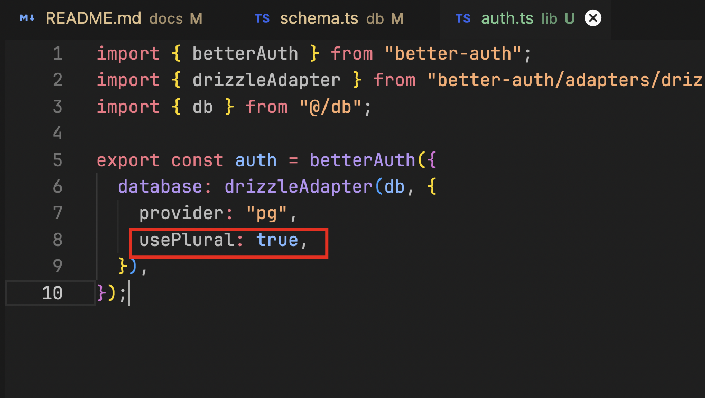

- também precisamos que o betterauth utilize as tabelas que criamos no `schema.ts` pois estamos usando nomes diferentes do padrão


- rodar novamente o comando abaixo

```bash
npx drizzle-kit push
```

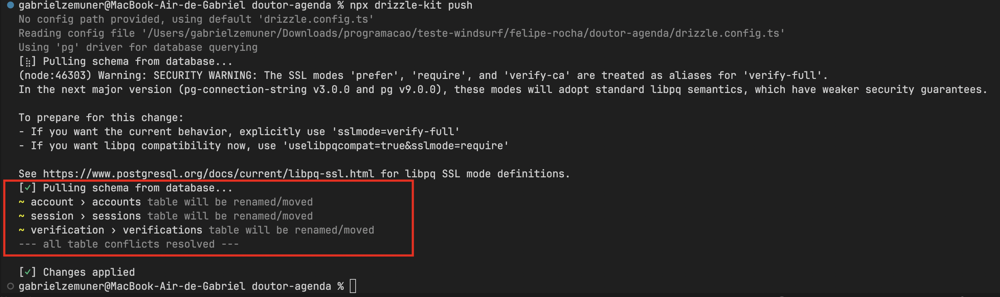

- podemos deletar o arquivo `auth-schema.ts` que havia sido gerado, pois utilizamos apenas pra adaptar o schema do betterauth ao nosso schema do drizzle no arquivo `schema.ts`

```bash
git add .
git commit -m "chore: add better auth setup"
```

- acrescentar a linha abaixo no arquivo `auth.ts`

```ts
emailAndPassword: { enabled: true },
```

- criar arquivo `/lib/auth-client.ts`

```ts
import { createAuthClient } from "better-auth/react";
export const authClient = createAuthClient();
```

- no arquivo `sign-up-form.tsx`, configurar a function onSubmit conforme abaixo

```tsx
  async function onSubmit(values: z.infer<typeof registerSchema>) {
    const { email, password, name } = values;

    await authClient.signUp.email(
      {
        email,
        password,
        name,
        // callbackURL: "/dashboard", // redirecionamento depois que o usuário confirma e-mail
      },
      {
        onSuccess: () => {
          router.push("/dashboard");
        },
      },
    );
  }
```

- criar rota/arquivo dashboard

- criar arquivo `route.ts`

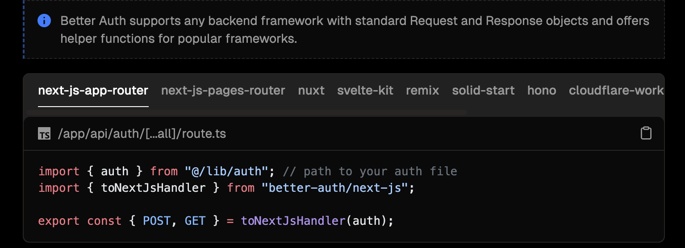

- pra conseguir cadastrar um novo usuário, necessário incluir no arquivo `auth.ts` 

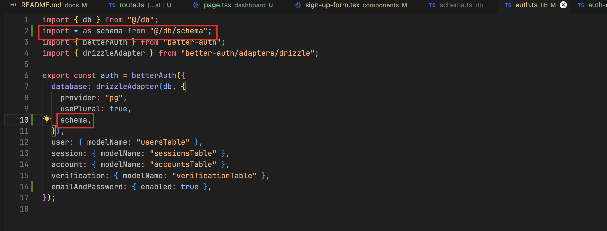

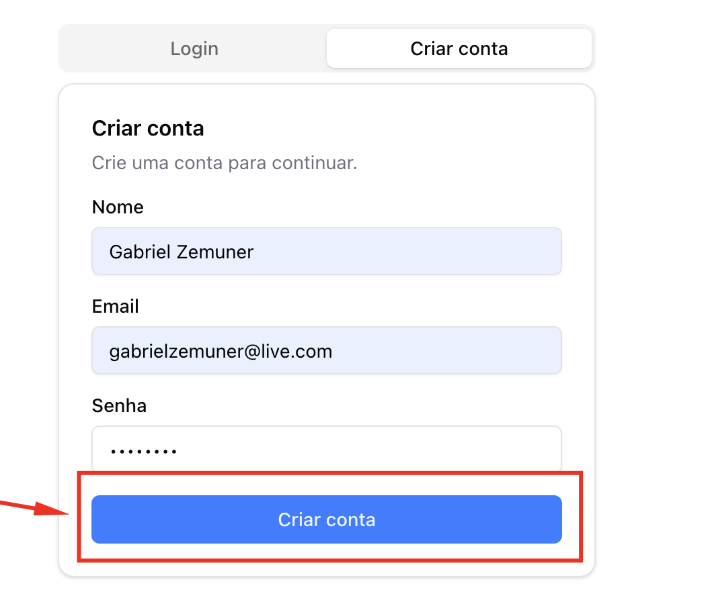

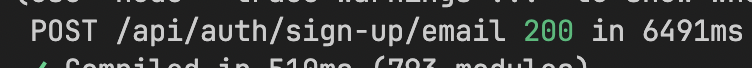

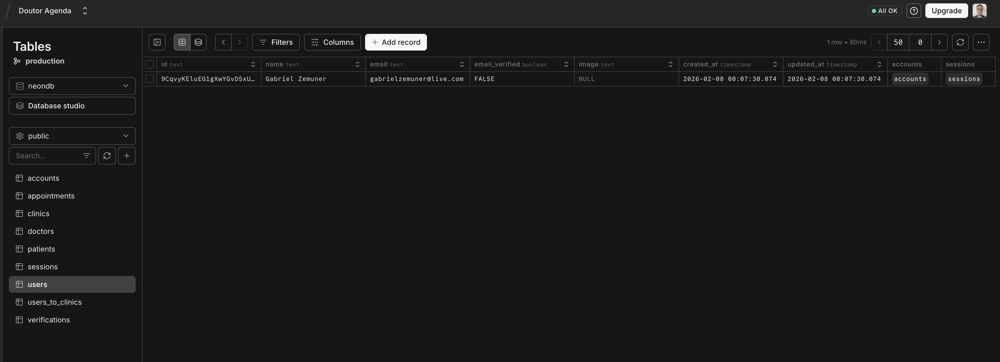

```bash
git add .
git commit -m "feat: add sign up"
```

- agora configurar no arquivo `login-form.tsx` o que fizemos no `sign-up-form.tsx` 

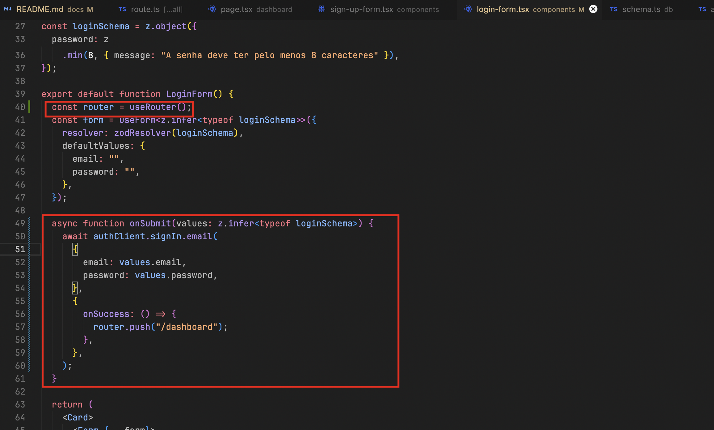

- se tentarmos logar com credenciais erradas, teremos um erro

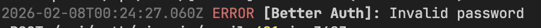

- configurar alerta (sonner/toast) em situações de erro

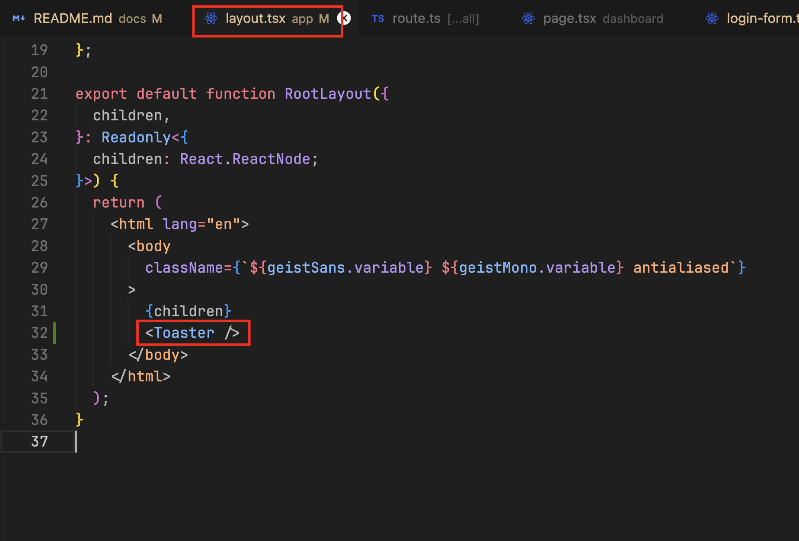

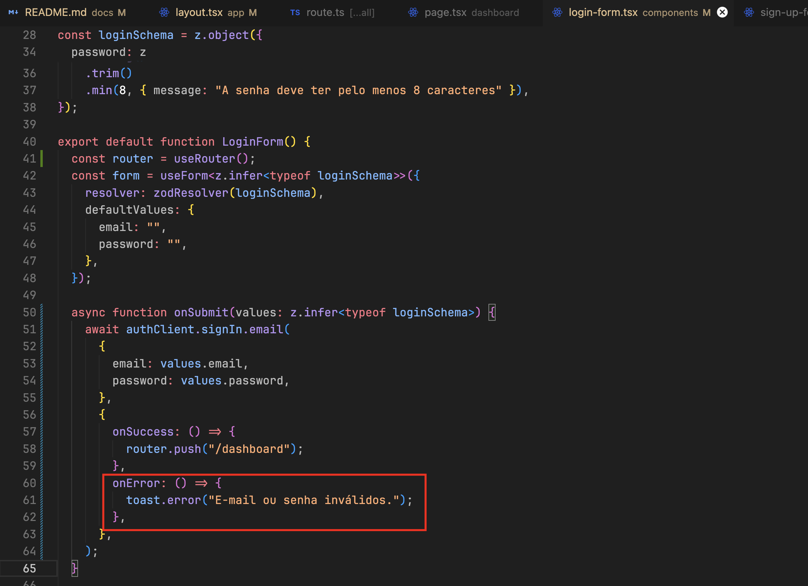

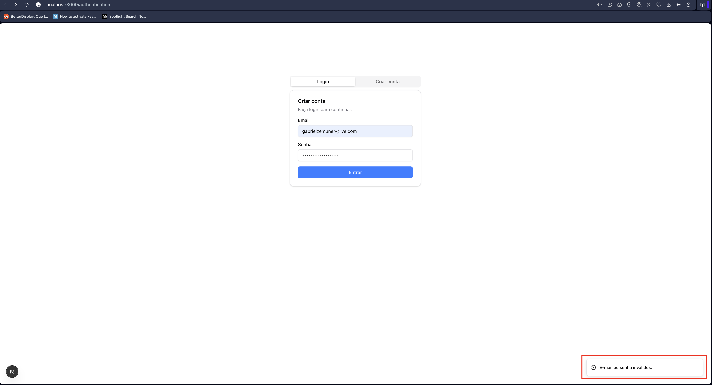

```bash
git add .
git commit -m "feat: add login"
```

- melhorias no form: tentativa de cadastro de e-mail existente

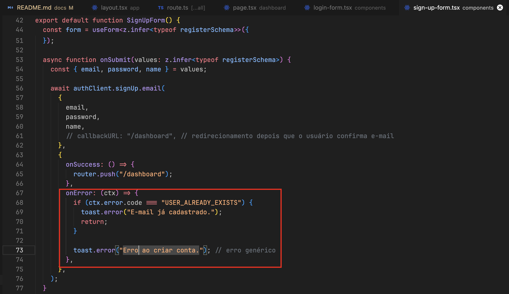

```bash
git add .
git commit -m "feat: add custom error message for existing user"
```

- melhorias no form: dados do usuário logado

 - server component: => acessar dados do backend componente `dashboard/page.tsx`
 - pra carregar os dados do usuário logado existem 2 formas:
    1. server component: => acessar dados diretamente do backend -> forma que estamos usando, com componente async await 
    2. client component: => acessar dados do frontend, porém aqui podemos ter delay na renderização (dados do usuário em branco por alguns segundos até que o componente seja renderizado)

 - se o usuário não estiver logado e tentar acessar dashboard, redirecionar para a tela de login => `dashboard/page.tsx`
 - se o usuário estiver logado e tentar acessar login, redirecionar para a tela de dashboard => `authentication/page.tsx`
 - ao cadastrar um novo usuário, redirecionar para a tela de dashboard logado => `sign-up-form.tsx`

```bash
git add .
git commit -m "feat: implement session management and redirection in authentication and dashboard pages"
```
### Redirecionar o usuário para criar uma clínica ao logar pela primeira vez

- usuário fez login:
  - já tem clínica?
    - não: redirecionar para a tela de criação de clínica
    - sim: redirecionar para a tela de dashboard (primeira clínica que o usuário tem cadastrada - no futuro criar dropdown pra que o usário alterne entre as clínicas)

- importar no arquivo db/index.ts conforme abaixo para ter o autocomplete disponível

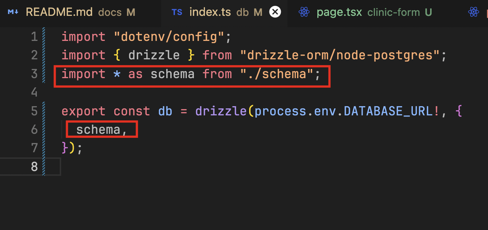

- shadcn utiliza composition pattern

- server actions: funções que rodam no backend (executadas no lado do servidor) => é como se fossem rotas de api

- vamos precisar de server actions pra cadastrar uma nova clínica

### Autenticação com google (betterauth)

- configurar google cloud platform

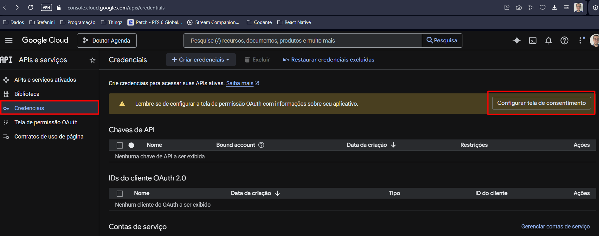

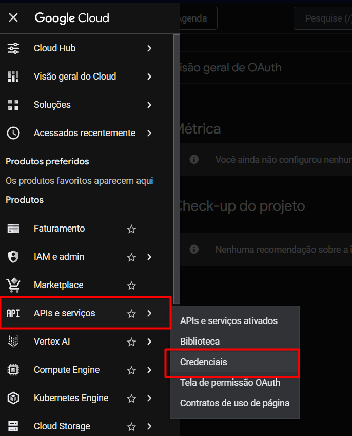

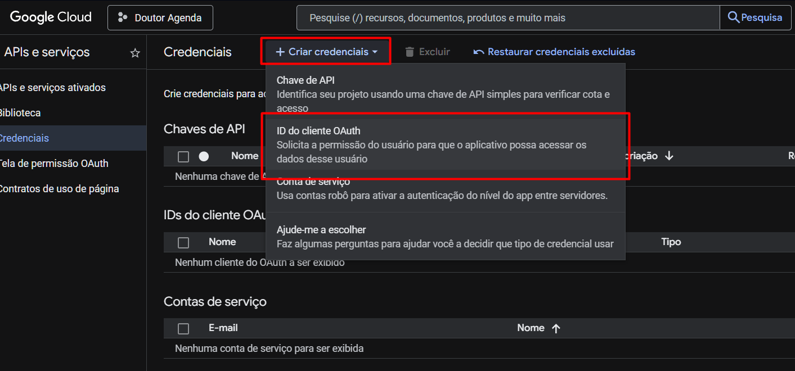

- oauth -> usar uma plataforma externa pra que o usuário consiga fazer login por meio dela (ex: google, facebook, etc)

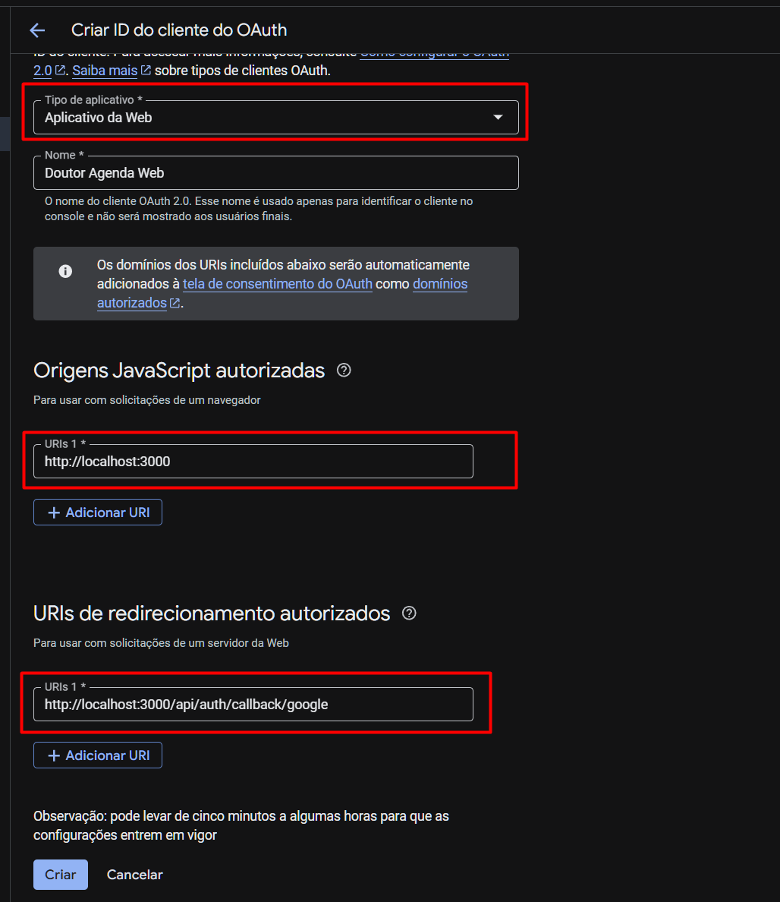

- configurar variáveis de ambiente:
  - GOOGLE_CLIENT_ID
  - GOOGLE_CLIENT_SECRET

- configurar provider do google no `auth.ts`

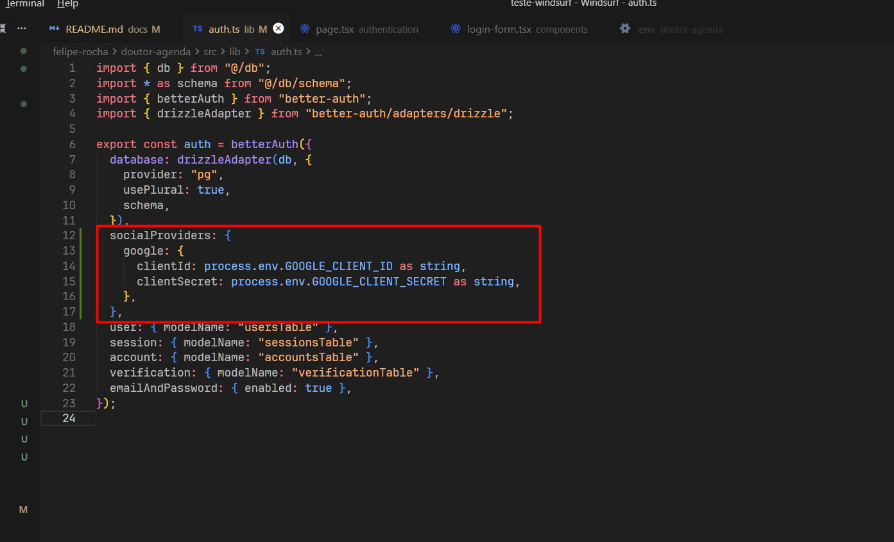

- adicionar botão de login com google no `login-form.tsx`

- adicionar botão de login com google no `sign-up-form.tsx`